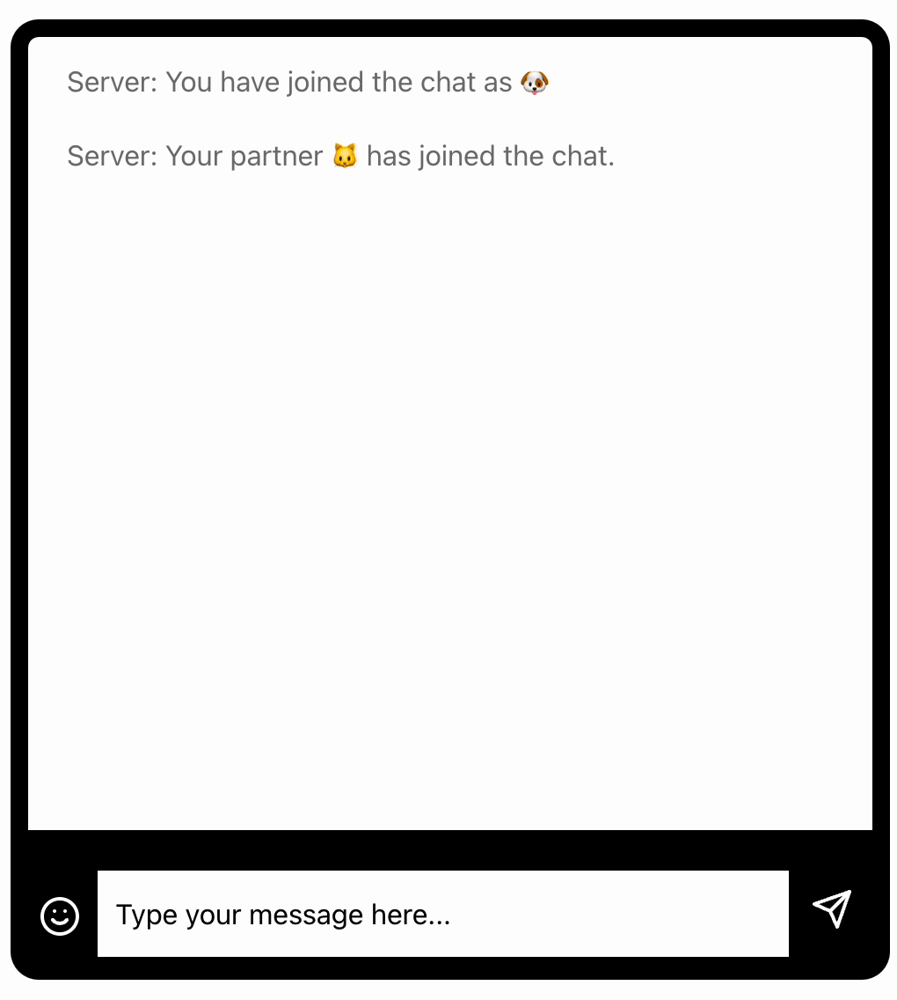

# mind-shared-reality-transfer (MSRT)

<p float="left">
  
</p>

## TODO

- [x] Add Firebase setup
- [x] Add Heroku deployment
- [] Add documentation on Heroku node server setup
- [] Add documentation on Firebase database setup

## Prerequisites

- Node.js (<https://nodejs.org/en/download>)
- Firebase (<https://firebase.google.com>)
- Heroku (<https://heroku.com>)

1. Clone this repo onto your computer.

```bash
git clone https://github.com/hawkrobe/shared-reality.git
```

2. Navigate to the `experiments/study2` directory and then install the dependencies using npm commands made accessible by Node.js.

```bash
npm install
```

3. Build the client in dev mode.

```bash
cd client
npm install
npm run dev
```

3. Run the task in dev mode - this should allow you to navigate to <http://localhost:5000> in a web browser to view the app. You will know this worked if the socket communication operates as expected.

```bash
cd .. # to navigate back to parent directory where `server.js` lives
npm run dev
```

4. To run in production mode, you will need to rebuild the client in production mode before starting the server.

```bash
cd client
npm run build
```

```bash
npm run start
```
